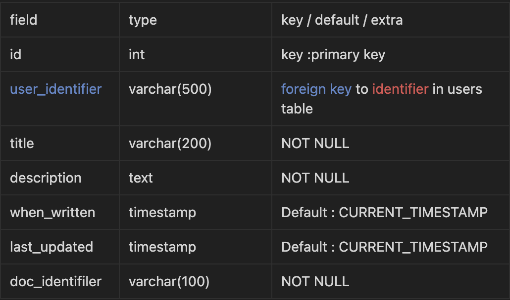

# Diary (Incomplete)

## Background
* * *
A Diary with basic functions.   
This is my first personal project. It is a project that has experienced the actual operation process of the service, from planning to development, test, and distribution.

 

## Getting started
* * *
    git clone https://github.com/Byeonminu/Diary.git
    cd Diary
    ...

 

## Development
* * *
### __1. Project Features__
 - Authentication: 회원가입시 아이디 중복 및 비밀번호 유효성 검사, 로그인 시 아이디 비밀번호 유효성 검사, 비밀번호 변경, 구글 OAuth 2.0
- Diary: CRUD   
 

### __2. Tech stack__
- 2.1 Front end
    - HTML / CSS
    - ejs

- 2.2 Back end
    - Nodejs(^16.13.1)
    - Express(^4.16.1)
    - Passport js

- 2.3 Database
    - MySQL
    - Sequelize(^6.19.0)

- 2.4 Test
    - Jest

- 2.5 Packages
    - bcrypt(for Password)
    - shortid(for Identifier)
    
 

### __3. Database Design__
- ### users - Table that stores user information
    

 

- ### writing - Table that stores user writings
    

 

### __4. Database Design__
### I did my best to make "Restful API".

 

### __5. Structure__